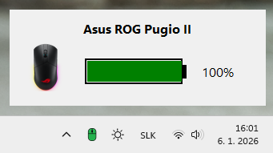

#  Asus ROG Pugio II Battery Status


A system tray application for monitoring battery status of Asus ROG Pugio II mouse via HID interface with real-time updates. This application can be adapted for other ROG mice models.



<a href='https://ko-fi.com/J3J11RQE5L' target='_blank'></a>

## Table of Contents

- [About](#about)
- [Features](#features)
- [Requirements](#requirements)
- [Installation](#installation)
- [Usage](#usage)
- [Customization](#customization-for-other-rog-mice)
- [Device Detection](#device-detection)
- [Technical Details](#technical-details)
- [Troubleshooting](#troubleshooting)
- [Translation](#translation-optional)
- [Auto-start Setup](#auto-start-setup-optional)
- [License](#license)

## About

This project is inspired by the work from https://github.com/seerge/g-helper, which implements proper methods for accessing battery information from ASUS devices through the HID protocol.

## Features

- Real-time battery status monitoring
- System tray icon with status indication
- Visual battery display popup window
- Charging status detection
- Automatic background execution
- Windows dark and light theme support
- Armoury Crate shortcut
- Single instance enforcement

## Requirements

- Python 3.7+
- Windows (Tested on Windows 10 & 11)
- Asus ROG mouse with HID support (Pugio II and similar models)

## Installation

1. Install required packages:

```bash
pip install hidapi pillow pystray
```

2. Image assets are already included in the `assets/images/` directory. You can replace them with your own images if desired:
   - `not_connected.png` - icon when mouse is disconnected
   - `charging.png` - icon when mouse is charging
   - `green.png` - icon when battery >= 75%
   - `orange.png` - icon when battery 25-74%
   - `red.png` - icon when battery < 25%
   - `mouse.png` - mouse image for popup window (70x70px)

## Usage

Run the application by executing:

```bash
Asus ROG Pugio II Battery Status.pyw
```

Or from command line:

```bash
python "Asus ROG Pugio II Battery Status.pyw"
```

The application automatically launches in system tray. Click the tray icon or use the context menu:

- **Show Battery Status** - Displays popup with visual battery indicator
- **Armoury Crate** - Opens Armoury Crate application
- **Quit** - Exits the application

## Customization for Other ROG Mice

This application is pre-configured for the Asus ROG Pugio II, but can be adapted for other supported ROG mice models. To customize it for your mouse:

1. **Rename the application** - Change the `.pyw` filename to match your mouse model
2. **Update window title** - Modify the tray icon title and window labels in the code
3. **Replace images** - Update the icons and mouse image in `assets/images/` folder
4. **Find your mouse PID** - Run `find_device_id.py` to identify your device and update the `PRODUCT_IDS_WITH_BATTERY` list accordingly

For a comprehensive list of supported ROG devices and their correct HID communication parameters, refer to the https://github.com/seerge/g-helper project.

## Device Detection

To find the correct Product ID and device information for your mouse, run:

```bash
python find_device_id.py
```

The script will output all connected ASUS devices (Vendor ID 0x0B05) with their details:
- Product string
- Manufacturer
- Product ID (PID) in hexadecimal format
- Device path
- Multiple Interface (MI) identifier

For Pugio II, the Product IDs are `0x1908` (without charging) and `0x1906` (with charging).

## Technical Details

### HID Communication

The application communicates with the mouse via HID reports:
- Sends request packet: `[0x00, 0x12, 0x07]`
- Receives response with battery data
- Battery level is read from byte 4 of the response with formula: `battery_percentage = raw_value * 25`

### Charging Detection

Charging status is determined by Product ID:
- `0x1906` = mouse is charging
- Other PIDs = mouse is not charging

## Troubleshooting

If the application doesn't work:

1. Run `find_device_id.py` and verify your mouse is detected
2. Check that all images are in the correct location
3. Verify Product IDs match your device
4. Verify Windows USB HID driver compatibility
5. Ensure mouse is connected via USB
6. Check that the HID device is not in use by other applications

## Auto-start Setup (Optional)

To run the application automatically on Windows startup:

1. Press `Win + R` and type `shell:startup`
2. Create a shortcut to `Asus ROG Pugio II Battery Status.pyw` in this folder
3. You can use the included `.ico` file for the shortcut icon

## Translation (Optional)

This application uses **Slovak as the native language of the creator**. Currently, only the system tray menu items are in Slovak. If you want to translate the UI to another language:

1. Open the main `.pyw` file
2. Replace all Slovak text strings (menu items, window titles, tooltip text) with your target language
3. Test the application to ensure all translations display correctly

## License

MIT License - see the [LICENSE](/LICENSE) file for details.

## Notes

- Application uses file lock to prevent multiple instances
- Default update interval is 5 seconds
- Popup window automatically closes after 2.5 seconds
- Application automatically detects Windows light and dark theme
- USB packet size is 65 bytes
- HID read timeout is 1000ms

